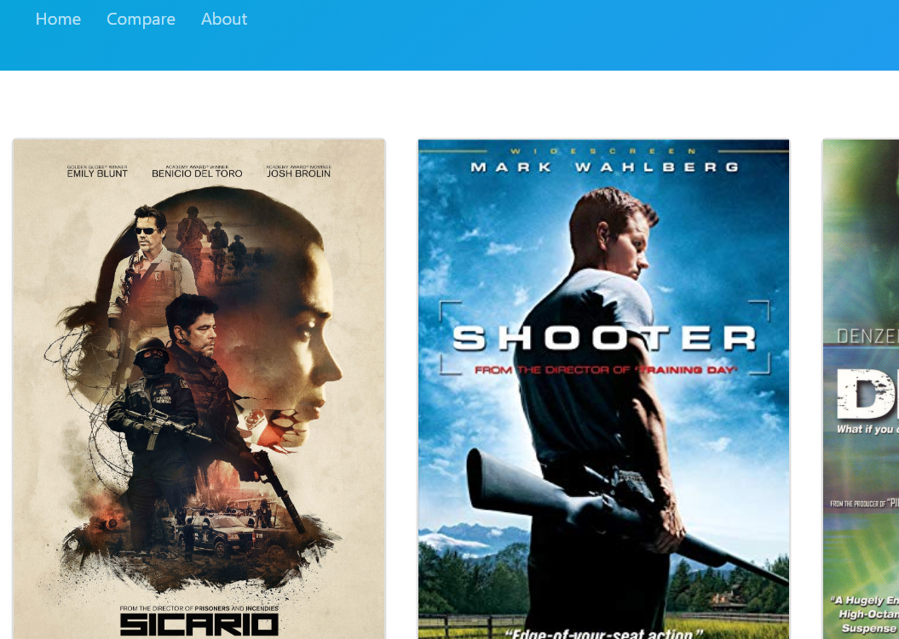

[row][col]
In this project, we were encouraged to build a SPA (single page application). JavaScript is really fun, once you get to know necessary commands its so easy to tweak the DOM into your own will. Rails API is used as a backend tool and with the new method "fetch" by ES6 is used to scrape the date into the client side. On top of that, I have built a movie compare app that scrapes data from OMDB API and compares two movies of your favorite.

[row][col]

[/col][/row]

[row][col]
Demo Video: 

[/col][col]
Code Source: 

[/col][col]
Blog Post: 

[/col][/row]
