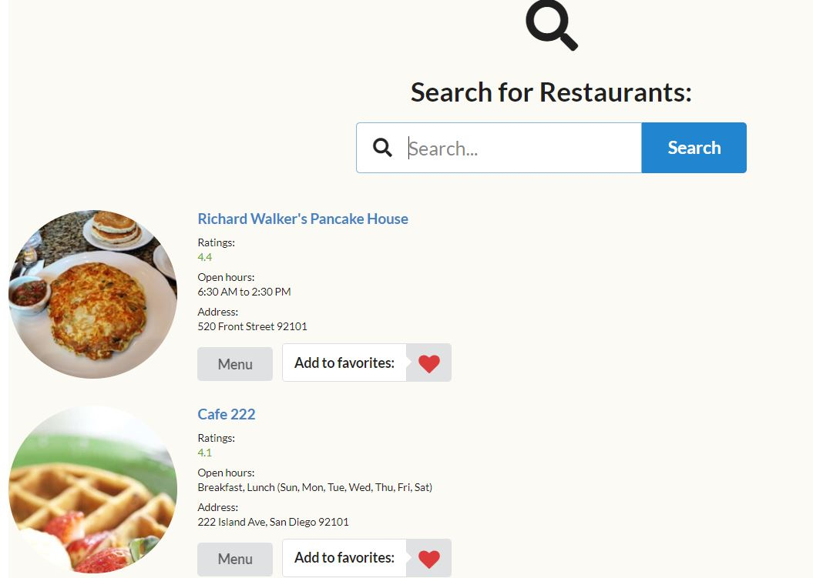

[row][col]
I have built this application as the last pre-graduation project work at Flatiron School. It was a decent experience to use React and Redux, the most popular Front End Framework by JavaScript. For Back End I used Ruby on Rails API to store some data in my own database and Zomato API to fetch restaurants data while the customer types a restaurant name, food name or a cuisine name in the input field on homepage.

[row][col]

[/col][/row]

[row][col]
Demo Video: 

[/col][col]
Code Source: 

[/col][col]
Blog Post: 

[/col][/row]
