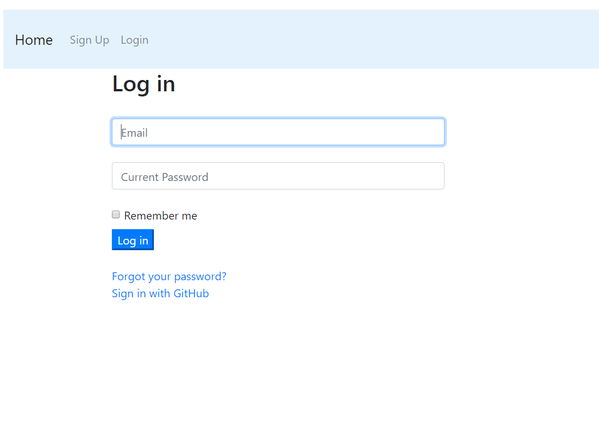

[row][col]
This Project is made purely with Ruby on Rails for both Front End and Back End. RESTful routes and MVC convention is neatly maintained. A user, web developer, can login to his account and store some data about his/her clients and products made for them. Omniauth login/logout and signup is impelemented. Third party login from GitHub is embedded through Omniauth.

[row][col]

[/col][/row]

[row][col]
Demo Video: 

[/col][col]
Code Source: 

[/col][col]
Blog Post: 

[/col][/row]
